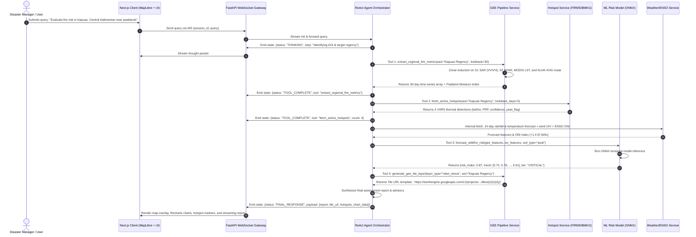
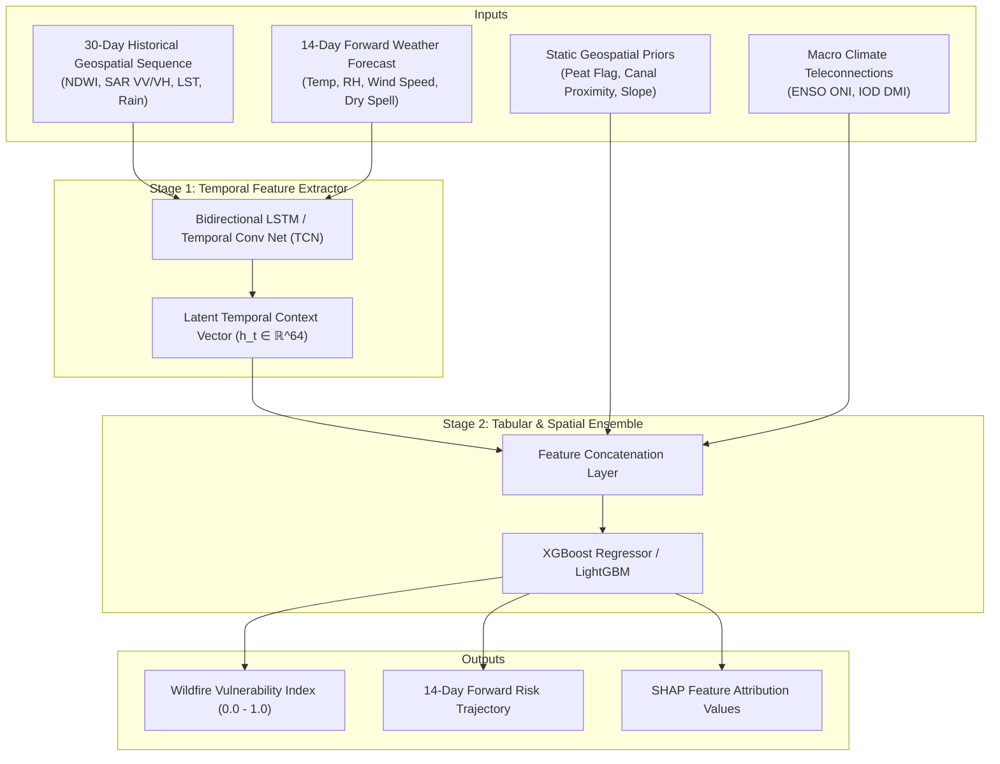
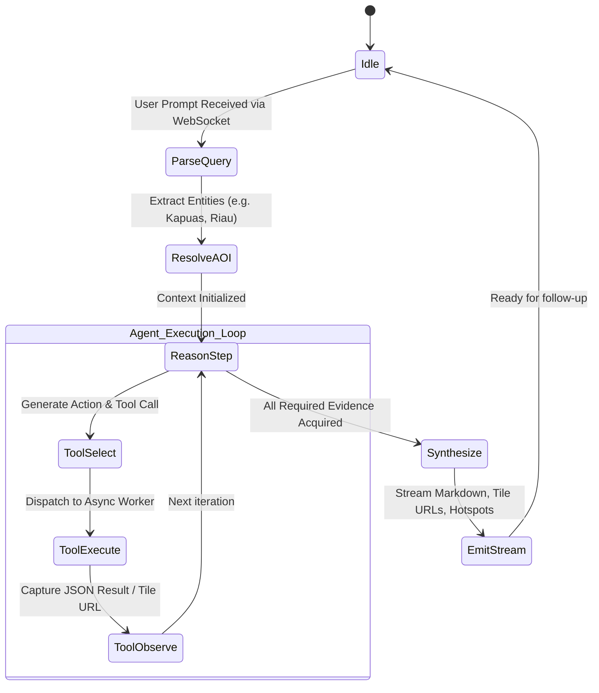
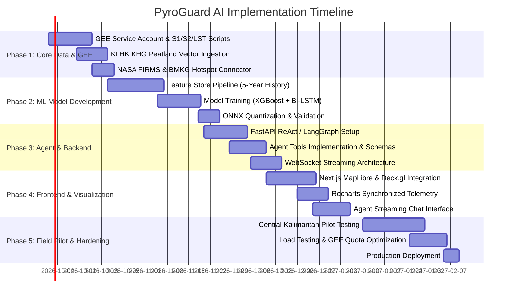

# Technical Design Document (TDD): PyroGuard AI
**Real-Time Tropical Peatland & Wildfire Risk Intelligence System for Indonesia**

---

## 1. Executive Summary & Document Overview

### 1.1 Document Purpose
This Technical Design Document (TDD) provides the architectural, algorithmic, and implementation specifications for **PyroGuard AI**, an agentic geospatial platform built to deliver near-real-time fuel moisture tracking, thermal anomaly detection, and 14-to-30-day wildfire risk forecasting across Indonesian tropical landscapes (specifically high-risk provinces such as Riau, Central Kalimantan, West Kalimantan, and South Sumatra).

### 1.2 Problem Statement
Equatorial Southeast Asia, particularly Indonesia, experiences recurring, catastrophic peatland and forest fires during dry and El Niño periods. Traditional optical satellite monitoring (e.g., standard Sentinel-2/Landsat composites) frequently fails due to pervasive cloud cover and thick smoke plumes. Furthermore, tropical peat fires propagate underground through dry *kubah gambut* (peat domes), remaining undetectable to optical surface reflectance until thermal anomalies erupt. Existing disaster monitoring solutions lack autonomous reasoning, multi-sensor radar-optical synthesis, hydrological context, and forward haze dispersion modeling.

### 1.3 System Objectives
- **All-Weather Sensing**: Combine C-Band Synthetic Aperture Radar (Sentinel-1 SAR) with multispectral imagery (Sentinel-2, Landsat 8/9, MODIS) via Google Earth Engine (GEE) to penetrate persistent cloud and smoke cover.
- **Autonomous Tool-Calling Agent**: Provide an interactive natural language interface capable of executing spatial reductions, fetching active thermal anomalies, triggering ML inference models, and generating dynamic map tile layers over WebSockets.
- **Peatland Hydrology Modeling**: Formulate a localized **Peatland Drying Index (PDI)** derived from Sentinel-1 VV/VH backscatter dynamics cross-referenced with Ministry of Environment and Forestry (KLHK) Peatland Hydrological Unit (*Kesatuan Hidrologi Gambut* / KHG) boundaries.
- **Forward Risk Forecasting**: Deliver 14-to-30-day wildfire probability forecasts ($0.0 - 1.0$ vulnerability score) via an optimized XGBoost + Bi-LSTM / Temporal Convolutional Network model.
- **Macro & Atmospheric Coupling**: Synthesize ENSO (El Niño Southern Oscillation) / IOD (Indian Ocean Dipole) climate indices and forward wind vector smoke/haze dispersion simulations.

---

## 2. System Architecture & High-Level Design

### 2.1 Fullstack Architecture Diagram

```text
┌─────────────────────────────────────────────────────────────────────────────────────────────┐
│                                 CLIENT TIER (Next.js 14+)                                   │
│  ┌───────────────────────────────┐ ┌───────────────────────────┐ ┌──────────────────────┐  │
│  │     MapLibre GL / Deck.gl     │ │    Recharts Time-Series   │ │    Agent Stream UI   │  │
│  │  - GEE XYZ Raster Overlay     │ │  - 30-Day NDWI/LST        │ │  - Real-time steps   │  │
│  │  - Hotspot Clusters (GeoJSON) │ │  - SAR VV/VH Ratio        │ │  - WebSocket feed    │  │
│  │  - Haze Dispersion Vectors    │ │  - Antecedent Rain Trend  │ │  - Markdown reports  │  │
│  └───────────────────────────────┘ └───────────────────────────┘ └──────────────────────┘  │
└──────────────────────────────────────────────▲──────────────────────────────────────────────┘
                                               │ WSS / HTTPS (JSON-RPC + SSE)
┌──────────────────────────────────────────────▼──────────────────────────────────────────────┐
│                               BACKEND TIER (Python 3.11 / FastAPI)                          │
│  ┌───────────────────────────────────────────────────────────────────────────────────────┐  │
│  │                        Asynchronous Agent Core (LangGraph / ReAct)                     │  │
│  │  - Context Manager & Prompt Orchestrator (Indonesian Domain Guardrails)                │  │
│  │  - Execution Graph: Intent Extraction -> Tool Resolution -> Synthesis                │  │
│  │  - WebSocket Connection & Event Streaming Manager                                     │  │
│  └───────────────────────────────────────────┬───────────────────────────────────────────┘  │
│                                              │ Internal Tool Invocations                    │
│      ┌───────────────────────┬───────────────┴───────────────┬──────────────────────┐       │
│      ▼                       ▼                               ▼                      ▼       │
│ ┌──────────────┐     ┌──────────────┐                ┌──────────────┐       ┌──────────────┐│
│ │  GEE Engine  │     │ Hotspot Core │                │   ML Model   │       │ Weather/ENSO ││
│ │   Service    │     │   Service    │                │  Inference   │       │   Service    ││
│ │ (ee Python)  │     │(FIRMS/BMKG)  │                │ (ONNX Runtime│       │(Open-Meteo & ││
│ │              │     │              │                │  / PyTorch)  │       │ NOAA CPC)    ││
│ └──────┬───────┘     └──────┬───────┘                └──────┬───────┘       └──────┬───────┘│
└────────┼────────────────────┼───────────────────────────────┼──────────────────────┼────────┘
         ▼                    ▼                               ▼                      ▼
┌─────────────────┐  ┌─────────────────┐             ┌─────────────────┐    ┌─────────────────┐
│ Google Earth    │  │ NASA FIRMS /    │             │ Feature Store & │    │ Open-Meteo &    │
│ Engine Platform │  │ BMKG Hotspot API│             │ Redis Cache     │    │ NOAA Climate API│
│ (S1/S2/LST/KHG) │  │ (VIIRS/MODIS)   │             │ (GeoJSON/Tiles) │    │ (Wind,Rain,ENSO)│
└─────────────────┘  └─────────────────┘             └─────────────────┘    └─────────────────┘
```

### 2.2 End-to-End Sequence Diagram



---

## 3. Data Engineering & Geospatial Pipeline

### 3.1 Satellite Datasets & Ingestion Specifications

| Source | Collection ID | Spatial / Temporal Resolution | Target Spectral / Synthetic Bands | Preprocessing & Masking Applied |
| :--- | :--- | :--- | :--- | :--- |
| **Sentinel-1 SAR** | `COPERNICUS/S1_GRD` | 10m / 6–12 days | C-band VV, VH backscatter ($\sigma^0$ in dB) | Border noise correction, Lee speckle filtering ($7\times7$), terrain radiometric flattening. |
| **Sentinel-2 MSI** | `COPERNICUS/S2_SR_HARMONIZED` | 10m–20m / 5 days | B3 (Green), B8 (NIR), B11 (SWIR-1), B12 (SWIR-2) | Cloud/cirrus mask via `COPERNICUS/S2_CLOUD_PROBABILITY` ($P_{cloud} < 40\%$) and SCL (Scene Classification Layer). |
| **Landsat 8/9** | `LANDSAT/LC08/C02/T1_L2` | 30m / 8–16 days | ST_B10 (Surface Temperature), SR_B5 (NIR), SR_B6/7 | Converted to Kelvin/Celsius, masked via `QA_PIXEL` bitmask. |
| **MODIS Thermal** | `MODIS/061/MOD11A1` | 1000m / Daily | LST_Day_1km, QC_Day | Daily interpolation to compensate for optical gaps. |
| **KLHK KHG** | User Asset / KLHK GeoJSON | Vector (1:50,000) | *Fungsi Lindung* (Protection), *Fungsi Budidaya* (Cultivation) | Converted to binary raster mask indicating peat dome vulnerability. |
| **NASA FIRMS** | NRT FIRMS API (VIIRS VNP14IMGTDL & NOAA-20/21) | 375m / 3–6 hours | Lat, Lon, Brightness Temp (I4/I5), FRP (MW), Confidence | Spatial join against KLHK KHG layer to flag peat vs. mineral fires. |
| **Open-Meteo & ECMWF**| Open-Meteo Seamless API | 0.1° (~11km) / Hourly & Daily | 2m Temp, Relative Humidity, 10m Wind U/V, 14-day Precip | Zonal interpolation across regency boundaries. |

### 3.2 Geospatial Computation & Index Formulations

#### 1. Normalized Difference Water Index (NDWI) - Gao Formula
Measures canopy water stress and vegetation moisture content:
$$\text{NDWI} = \frac{\rho_{\text{NIR}} - \rho_{\text{SWIR1}}}{\rho_{\text{NIR}} + \rho_{\text{SWIR1}}} = \frac{\text{B8} - \text{B11}}{\text{B8} + \text{B11}}$$

#### 2. Normalized Burn Ratio (NBR) & Differenced NBR (dNBR)
Detects pre-fire desiccated biomass and quantifies burn severity:
$$\text{NBR} = \frac{\rho_{\text{NIR}} - \rho_{\text{SWIR2}}}{\rho_{\text{NIR}} + \rho_{\text{SWIR2}}} = \frac{\text{B8} - \text{B12}}{\text{B8} + \text{B12}}$$
$$\text{dNBR} = \text{NBR}_{\text{pre-fire}} - \text{NBR}_{\text{post-fire}}$$

#### 3. SAR Cross-Ratio & Peatland Moisture
In tropical peat soils, radar backscatter ($\sigma^0$) is heavily influenced by dielectric permittivity, which is directly tied to volumetric soil water content. We derive:
$$\text{SAR Cross-Ratio (CR)} = \frac{\sigma^0_{\text{VH}}}{\sigma^0_{\text{VV}}} \quad (\text{linear units}) \implies \sigma^0_{\text{VH}} - \sigma^0_{\text{VV}} \quad (\text{dB})$$
$$\Delta \sigma^0_{\text{VV}} = \sigma^0_{\text{VV}}(t) - \overline{\sigma^0_{\text{VV}}}_{\text{baseline, wet season}}$$
A precipitous drop in $\sigma^0_{\text{VV}}$ (> 2.5 dB below wet baseline) in degraded peat corresponds to water table drawdown exceeding $40\text{ cm}$ below ground surface—the statutory danger threshold established by the Indonesian Peatland and Mangrove Restoration Agency (BRGM).

---

## 4. Machine Learning & Predictive Modeling Architecture

### 4.1 Problem Formulation
The wildfire risk forecasting module solves a multi-modal spatial-temporal regression and classification task:
- **Input Feature Vector**: Sequence of historical 30-day daily aggregated features $\mathbf{X}_t = [x_{t-29}, \dots, x_t]$ plus forward 14-day forecasted meteorological conditions $\mathbf{W}_{t+1:t+14}$.
- **Target Output**: 
  1. A continuous **Wildfire Vulnerability Index (WVI)**: $y_{\text{WVI}} \in [0.0, 1.0]$.
  2. A 14-day forward daily risk curve: $\hat{\mathbf{y}}_{t+1:t+14} \in [0.0, 1.0]^{14}$.
  3. Risk Tier classification: `LOW` ($<0.30$), `MODERATE` ($0.30-0.60$), `HIGH` ($0.60-0.80$), `CRITICAL` ($>0.80$).

### 4.2 Feature Engineering Matrix

```text
┌──────────────────────────────┬────────────────────────────────────────────────────────┐
│ Feature Dimension            │ Specific Indices & Transformations                     │
├──────────────────────────────┼────────────────────────────────────────────────────────┤
│ Optical Vegetation Moisture  │ S2 NDWI (Mean, 7-day rolling delta, 30-day min)        │
│ Thermal Stress               │ MODIS/Landsat LST (°C, anomaly relative to 5-yr mean)  │
│ Radar Soil/Peat Desiccation  │ S1 VV backscatter, VH backscatter, VV/VH ratio         │
│ Antecedent Precipitation     │ 3-day, 7-day, 14-day, 30-day cumulative rainfall (mm)  │
│ Dry Spell Duration           │ Consecutive days with precipitation < 1.0 mm          │
│ Forecasted Weather (14-day)  │ Predicted max temp, min RH, max 10m wind gust          │
│ Spatial / Soil Priors        │ Peat Dummy (1 if KHG zone, 0 if mineral), Peat Depth,  │
│                              │ Distance to nearest canal/drainage (Dinas PU data)     │
│ Macro-Climate Teleconnection │ ENSO Nino 3.4 Index anomaly, IOD Dipole Mode Index     │
└──────────────────────────────┴────────────────────────────────────────────────────────┘
```

### 4.3 Model Architecture: Hybrid Temporal Fusion / Bi-LSTM + XGBoost

To balance deep temporal modeling with tabular gradient-boosted interpretability, the system uses a two-stage ensemble:



### 4.4 Training & Validation Strategy
- **Ground Truth**: Fire presence derived from NASA FIRMS VIIRS (confidence $\ge 80\%$, FRP $\ge 15\text{ MW}$) intersecting Sentinel-2 dNBR post-event burn scars ($>0.27$).
- **Spatial-Temporal Block Cross-Validation**: To prevent spatial auto-correlation leakage, training splits are partitioned by island/province groups (e.g., Train on Sumatra & West Kalimantan, validate on Central Kalimantan) and blocked by alternating years (2019, 2021, 2023 for training; 2020, 2022, 2024 for validation).
- **Target Loss Function**: Asymmetric Focal MSE to heavily penalize false negatives in high-risk peatland scenarios:
  $$\mathcal{L}_{\text{asym}}(y, \hat{y}) = \begin{cases} \alpha (y - \hat{y})^2 & \text{if } y > \hat{y} \text{ (Underprediction)} \\ (1 - \alpha)(y - \hat{y})^2 & \text{if } y \le \hat{y} \end{cases} \quad \text{with } \alpha = 0.75$$

### 4.5 Production Inference Engine (ONNX Runtime)
The trained models are exported to **ONNX (Open Neural Network Exchange)** format, executed via `onnxruntime` with AVX-512 optimization inside the FastAPI worker. Average inference latency: **$< 45\text{ ms}$** per administrative regency.

---

## 5. Agent Architecture & Tool Execution Engine

### 5.1 ReAct Agent Framework (LangGraph)
The agent operates on an asynchronous state graph that interprets natural language, resolves geographic administrative boundaries in Indonesia (National $\to$ Province $\to$ Regency / *Kabupaten* $\to$ District / *Kecamatan*), selects appropriate geospatial tools, handles intermediate errors, and streams output via WebSockets.



### 5.2 Core Tool Definitions & Schemas

#### Tool 1: `extract_regional_fire_metrics`
*Description*: Executes Earth Engine zonal statistics over an AOI polygon or administrative name to extract 30-day rolling optical, thermal, and SAR metrics.

```json
{
  "name": "extract_regional_fire_metrics",
  "description": "Calculates 30-day time series of NDWI, SAR VV/VH backscatter, LST, and rainfall across a specified Indonesian regency or GeoJSON bounding box.",
  "parameters": {
    "type": "object",
    "properties": {
      "region_name": {
        "type": "string",
        "description": "Name of the Indonesian regency or province (e.g. 'Kapuas Regency', 'Pulang Pisau', 'Riau')."
      },
      "geojson": {
        "type": "object",
        "description": "Optional GeoJSON geometry if custom AOI polygon is drawn by user."
      },
      "lookback_days": {
        "type": "integer",
        "default": 30,
        "description": "Number of days of historical telemetry to retrieve."
      }
    },
    "required": ["region_name"]
  }
}
```

*Output Schema*:
```json
{
  "region_name": "Kapuas Regency",
  "province": "Central Kalimantan",
  "aoi_area_ha": 1499900.0,
  "peatland_area_pct": 68.4,
  "time_series": [
    {
      "date": "2026-09-01",
      "ndwi_mean": 0.42,
      "sar_vv_db": -8.1,
      "sar_vh_db": -14.2,
      "sar_cross_ratio": 6.1,
      "lst_celsius": 29.8,
      "precip_mm": 12.4
    }
  ],
  "delta_14d": {
    "ndwi_change_pct": -22.4,
    "sar_vv_drop_db": 2.8,
    "lst_anomaly_celsius": +3.1
  },
  "peatland_drying_status": "CRITICAL_DRAWDOWN"
}
```

#### Tool 2: `fetch_active_hotspots`
*Description*: Queries real-time thermal anomalies from NASA FIRMS (VIIRS NOAA-20/21, Suomi NPP) and BMKG data feeds within the AOI, cross-referencing them against KLHK Peatland Hydrological Unit (KHG) layers.

```json
{
  "name": "fetch_active_hotspots",
  "description": "Fetches near-real-time thermal hotspots within the target AOI for the past 24-72 hours, including Fire Radiative Power (FRP) and peatland intersection tags.",
  "parameters": {
    "type": "object",
    "properties": {
      "region_name": {
        "type": "string",
        "description": "Target administrative name."
      },
      "lookback_hours": {
        "type": "integer",
        "default": 72,
        "enum": [24, 48, 72]
      },
      "min_confidence": {
        "type": "string",
        "default": "nominal",
        "enum": ["low", "nominal", "high"]
      }
    },
    "required": ["region_name"]
  }
}
```

*Output Schema*:
```json
{
  "count": 4,
  "hotspots": [
    {
      "id": "viirs_20260914_01",
      "latitude": -2.8542,
      "longitude": 114.2185,
      "brightness_temp_kelvin": 348.6,
      "frp_mw": 24.8,
      "acquisition_time": "2026-09-14T06:12:00Z",
      "satellite": "NOAA-21",
      "confidence": "high",
      "is_peatland": true,
      "khg_name": "KHG Sungai Kahayan - Sungai Kapuas",
      "distance_to_canal_m": 120.0
    }
  ]
}
```

#### Tool 3: `forecast_wildfire_risk`
*Description*: Ingests extracted GEE time-series features, local weather forecasts, and climate indices into the ML inference model to produce 14-to-30-day forward risk projections.

```json
{
  "name": "forecast_wildfire_risk",
  "description": "Runs ONNX risk model inference to predict 14-day wildfire vulnerability index, probability trajectory, and top contributing drivers.",
  "parameters": {
    "type": "object",
    "properties": {
      "metrics_payload": {
        "type": "object",
        "description": "Telemetry payload returned by extract_regional_fire_metrics."
      },
      "forecast_horizon_days": {
        "type": "integer",
        "default": 14,
        "enum": [14, 30]
      }
    },
    "required": ["metrics_payload"]
  }
}
```

*Output Schema*:
```json
{
  "wildfire_vulnerability_index": 0.87,
  "risk_tier": "CRITICAL",
  "trend": [0.72, 0.74, 0.78, 0.81, 0.84, 0.86, 0.87, 0.89, 0.90, 0.91, 0.91, 0.92, 0.92, 0.93],
  "top_drivers": [
    {"feature": "SAR Peat Drawdown (ΔVV > 2.5dB)", "importance": 0.38},
    {"feature": "14-Day Consecutive Rainless Spell", "importance": 0.29},
    {"feature": "NDWI Canopy Moisture Depletion (-22%)", "importance": 0.18},
    {"feature": "Macro Climate (Positive IOD + El Niño)", "importance": 0.15}
  ],
  "recommended_advisory": "Trigger Level 1 Fire Patrol & canal-blocking water retention operations immediately."
}
```

#### Tool 4: `generate_gee_tile_layer`
*Description*: Compiles an Earth Engine visualization pipeline and exports a dynamically signed XYZ Tile URL for client MapLibre/Deck.gl display.

```json
{
  "name": "generate_gee_tile_layer",
  "description": "Generates a dynamic Earth Engine XYZ map tile URL for visualization layers such as NDWI stress, SAR moisture, dNBR scars, or Land Surface Temp.",
  "parameters": {
    "type": "object",
    "properties": {
      "layer_type": {
        "type": "string",
        "enum": ["ndwi_stress", "sar_moisture_anomaly", "lst_thermal", "peat_vulnerability"],
        "description": "Visual layer to generate."
      },
      "region_name": {
        "type": "string",
        "description": "Region bounding box."
      }
    },
    "required": ["layer_type", "region_name"]
  }
}
```

*Output Schema*:
```json
{
  "layer_type": "ndwi_stress",
  "tile_url_template": "https://earthengine.googleapis.com/v1/projects/pyroguard-ai/maps/map-abc123xyz-456/tiles/{z}/{x}/{y}",
  "legend": {
    "title": "NDWI Vegetation Water Stress",
    "palette": ["#7f0000", "#d7301f", "#fc8d59", "#fee8c8", "#41b6c4", "#225ea8"],
    "min": -0.3,
    "max": 0.6,
    "units": "Index"
  },
  "expires_at": "2026-09-14T18:31:00Z"
}
```

---

## 6. Specialized Indonesia Implementations

### 6.1 Peatland Drying Index (PDI) & Water Table Modeling

Tropical peatlands in Indonesia (*lahan gambut*) hold vast reserves of carbon. When drained by oil palm or pulpwood plantation canals (*kanal*), the water table drops. Once the water table recedes $>40\text{ cm}$ below ground surface, the dried acrotelm becomes hyper-flammable.

#### Mathematical Formulation of PDI
The Peatland Drying Index ($I_{\text{PDI}} \in [0, 1]$) couples radar backscatter with thermal inertia:
$$I_{\text{PDI}}(x, y, t) = w_1 \cdot f_{\text{SAR}}(\sigma^0_{\text{VV}}(t), \sigma^0_{\text{VH}}(t)) + w_2 \cdot f_{\text{LST}}(T_s(t)) + w_3 \cdot f_{\text{Rain}}(R_{14}(t))$$

Where:
- $f_{\text{SAR}} = \text{clamp}\left(\frac{\overline{\sigma^0_{\text{VV}}}_{\text{wet}} - \sigma^0_{\text{VV}}(t)}{\theta_{\text{crit}}}, 0, 1\right)$, with empirical critical threshold $\theta_{\text{crit}} = 3.5\text{ dB}$.
- $f_{\text{LST}} = \text{clamp}\left(\frac{T_s(t) - \overline{T_s}_{\text{baseline}}}{8.0}, 0, 1\right)$ (thermal anomaly scaling).
- $f_{\text{Rain}} = \exp\left(-\frac{R_{14}(t)}{25.0}\right)$ ($R_{14}$ is 14-day cumulative rainfall in mm).
- Weights calibrated against BRGM ground sensors: $w_1 = 0.50$, $w_2 = 0.25$, $w_3 = 0.25$.

```python
def compute_peatland_drying_index(
    sar_vv: float,
    sar_wet_baseline: float,
    lst: float,
    lst_baseline: float,
    rain_14d_mm: float
) -> float:
    """
    Computes normalized Peatland Drying Index (0.0 = Saturated, 1.0 = Extreme Desiccation).
    """
    import math
    
    # Radar soil moisture desiccation factor
    vv_drop = max(0.0, sar_wet_baseline - sar_vv)
    f_sar = min(1.0, vv_drop / 3.5)
    
    # Thermal anomaly factor
    f_lst = min(1.0, max(0.0, (lst - lst_baseline) / 8.0))
    
    # Exponential decay of antecedent rain
    f_rain = math.exp(-rain_14d_mm / 25.0)
    
    pdi = (0.50 * f_sar) + (0.25 * f_lst) + (0.25 * f_rain)
    return round(pdi, 3)
```

### 6.2 Monsoon & Macro Climate Teleconnection (ENSO & IOD)

Indonesia's dry season (typically June to October) is exacerbated exponentially when two macro-climatic phenomena coincide:
1. **El Niño (Positive ENSO)**: Shift of warm Pacific pool eastward, suppressing convective rain across Indonesia. Monitored via the **Oceanic Niño Index (ONI)** in the Niño 3.4 region ($5^\circ\text{N}-5^\circ\text{S}, 170^\circ\text{W}-120^\circ\text{W}$).
2. **Positive Indian Ocean Dipole (+IOD)**: Warmer waters in the western Indian Ocean and anomalous cooling in the eastern Indian Ocean south of Java/Sumatra. Monitored via the **Dipole Mode Index (DMI)**.

#### Agent Context Conditioning
The backend scheduler executes a weekly ingestion job fetching NOAA CPC and Bureau of Meteorology (BoM) indices:
- When $\text{ONI} \ge +0.5^\circ\text{C}$ and $\text{DMI} \ge +0.4^\circ\text{C}$ ("Super-Dipole / El Niño Compound"), the agent injects a **Drought Amplifier Flag** into the system prompt.
- This modifies risk heuristics: base risk thresholds are shifted downwards by 15%, accounting for rapid soil moisture depletion and extended fire seasons.

### 6.3 Haze Vector Simulation & Smoke Dispersion Modeling

To assist transboundary haze coordination and provincial emergency response, active hotspots are integrated with 10m/850hPa wind vectors ($U, V$ components) to compute forward Gaussian plume trajectories.

#### Formulation
For an active hotspot $i$ at coordinates $(\lambda_i, \phi_i)$ with Fire Radiative Power $\text{FRP}_i$ (MW):
- **Emission Rate Estimate**: $Q_i = k_{\text{biomass}} \cdot \text{FRP}_i \cdot C_{\text{peat}}$, where $C_{\text{peat}} = 2.8$ if located on KHG peat soil due to smoldering combustion emitting high $\text{PM}_{2.5}$ and CO.
- **Dispersion Trajectory**: Propagated for $T = 6, 12, 24\text{ hours}$ using forecast wind velocities $u_{10}, v_{10}$:
  $$\lambda(t) = \lambda_0 + \int_0^t \frac{u(s)}{R_{\text{earth}} \cos \phi(s)} ds, \quad \phi(t) = \phi_0 + \int_0^t \frac{v(s)}{R_{\text{earth}}} ds$$
- The frontend renders an interactive vector cone / directional polygon indicating anticipated smoke corridors toward vulnerable populations (e.g., Palangka Raya, Pekanbaru, or Singapore/Malaysia cross-border corridors).

---

## 7. Frontend Architecture (Next.js & MapLibre GL)

### 7.1 Tech Stack Specification
- **Framework**: Next.js 14+ (App Router, Server Components for layout, Client Components for interactive map/agent).
- **Map Engine**: MapLibre GL JS (v4.x) + Deck.gl (v9.x) for high-performance WebGL layer overlays.
- **Data Visualizations**: Recharts for synchronized multi-axis time-series (NDWI, SAR VV, LST, Rainfall).
- **Streaming UI**: Custom WebSocket hook (`useAgentSocket`) with resilient auto-reconnect, exponential backoff, and step-by-step agent execution visualization.
- **Styling**: Tailwind CSS + Radix UI primitives.

### 7.2 UI/UX Layout Structure

```text
┌────────────────────────────────────────────────────────────────────────────────────────┐
│  PyroGuard AI: Indonesia Wildfire Intelligence Dashboard              [Status: Online] │
├────────────────────────────────────────┬───────────────────────────────────────────────┤
│  LEFT PANE: MapLibre GL Workspace      │  RIGHT PANE: Agent Dialogue & Telemetry       │
│                                        │                                               │
│  [Layer Control: NDWI | SAR | LST]     │  ┌─────────────────────────────────────────┐  │
│  ┌──────────────────────────────────┐  │  │ User: "Current fire risk in Kapuas?"    │  │
│  │                                  │  │  └─────────────────────────────────────────┘  │
│  │   [GEE Raster Tile Layer: NDWI]  │  │  ┌─────────────────────────────────────────┐  │
│  │                                  │  │  │ ⚙️ Agent Thought:                       │  │
│  │   🔥 Hotspot VIIRS (FRP 24.8 MW) │  │  │ - Querying GEE zonal reduction... Done  │  │
│  │      \                           │  │  │ - 4 active hotspots detected in peat.   │  │
│  │       ==> [Haze Vector Cone]     │  │  │ - Running ONNX 14-day risk model...     │  │
│  │                                  │  │  └─────────────────────────────────────────┘  │
│  │   📍 Kapuas Regency AOI Boundary │  │  ┌─────────────────────────────────────────┐  │
│  │                                  │  │  │ Risk Assessment: CRITICAL (0.87 / 1.0) │  │
│  └──────────────────────────────────┘  │  │ Summary report and tactical actions...  │  │
│                                        │  └─────────────────────────────────────────┘  │
│  BOTTOM DRAWER: Zonal Trends (Recharts)│  ┌─────────────────────────────────────────┐  │
│  [=== NDWI 30d ===] [=== SAR VV ===]   │  │ Prompt Input: [ Ask agent...        ] ⏎ │  │
└────────────────────────────────────────┴───────────────────────────────────────────────┘
```

### 7.3 Real-Time WebSocket Protocol Contract

#### Client-to-Server Messages
```typescript
interface ClientQueryMessage {
  type: "user_query";
  session_id: string;
  payload: {
    query: string;
    active_aoi?: {
      type: "Polygon" | "MultiPolygon";
      coordinates: number[][][];
    };
    preferred_language?: "en" | "id"; // English or Bahasa Indonesia
  };
}
```

#### Server-to-Client Event Stream
```typescript
type ServerAgentEvent = 
  | { type: "agent_thought"; payload: { text: string; step: number } }
  | { type: "tool_start"; payload: { tool: string; input: Record<string, any> } }
  | { type: "tool_result"; payload: { tool: string; output: Record<string, any> } }
  | { type: "map_layer_update"; payload: { layer_type: string; tile_url: string; legend: any } }
  | { type: "hotspots_update"; payload: { features: GeoJSON.FeatureCollection } }
  | { type: "haze_vectors_update"; payload: { cones: GeoJSON.FeatureCollection } }
  | { type: "agent_final_response"; payload: { markdown: string; risk_score: number; metrics: any } }
  | { type: "agent_error"; payload: { code: string; message: string } };
```

---

## 8. Backend API & Service Specifications

### 8.1 REST Endpoints

#### `GET /api/v1/health`
- **Purpose**: Liveness/readiness probe.
- **Response**: `{ status: "ok", gee_authenticated: true, onnx_loaded: true, redis_connected: true }`

#### `GET /api/v1/regions`
- **Purpose**: Autocomplete administrative regencies and provinces in Indonesia.
- **Parameters**: `q=Kapuas`
- **Response**:
```json
[
  {
    "id": "ID-62-03",
    "name": "Kabupaten Kapuas",
    "province": "Kalimantan Tengah",
    "center": [114.386, -2.015],
    "bbox": [113.43, -3.45, 114.98, -0.85],
    "has_peatland": true
  }
]
```

#### `GET /api/v1/hotspots/feed`
- **Purpose**: Raw GeoJSON feed of active hotspots in Indonesia for the past 24 hours.
- **Parameters**: `bbox=113.0,-3.5,115.5,-0.5&min_frp=10.0`
- **Response**: GeoJSON FeatureCollection with thermal properties.

### 8.2 WebSocket Endpoint: `/ws/agent`
- **Path**: `ws://<host>/ws/agent?session_id=<uuid>`
- **Behavior**: Manages continuous bidirectional ReAct agent session with state persistence in Redis.

---

## 9. Security, Quotas & Performance Engineering

### 9.1 Google Earth Engine Quota & Latency Mitigation
- **Challenge**: Direct synchronous GEE zonal reductions on large polygons (e.g., entire provinces) can take 5–15 seconds and exhaust interactive request quotas (maximum concurrent interactive requests per project).
- **Optimization Strategy**:
  1. **Hierarchical Spatial Grids**: Provinces are partitioned into fixed H3 hexagonal bins (Resolution 7, ~5km edge).
  2. **Tiered Redis Caching**:
     - *Raw Zonal Statistics*: Cached in Redis with a 6-hour TTL (matching satellite overpass frequencies).
     - *Tile URLs (`ee.Image.getMapId()`)*: Cached with an 18-hour TTL (matching GEE signature expiry of 24h).
  3. **Downsampled Pre-Reductions**: Execute zonal reductions at scale `100m` for fast interactive agent reasoning, and trigger `30m` asynchronous batch queries only on explicit drill-down requests.

### 9.2 Rate Limiting & Concurrency Architecture

```text
┌─────────────────────────────────────────────────────────┐
│              Client Request / WebSocket                 │
└───────────────────────────┬─────────────────────────────┘
                            ▼
┌─────────────────────────────────────────────────────────┐
│        Traefik / Nginx API Gateway & Rate Limiter       │
│  - Token Bucket: Max 30 req/min per IP                  │
│  - WebSocket: Max 3 concurrent sessions per user        │
└───────────────────────────┬─────────────────────────────┘
                            ▼
┌─────────────────────────────────────────────────────────┐
│                 FastAPI Async Worker Pool               │
│   (uvicorn workers behind asyncio Semaphore limit = 20) │
└─────────────┬─────────────────────────────┬─────────────┘
              ▼                             ▼
┌───────────────────────────┐ ┌───────────────────────────┐
│ Redis Cache (Hit: < 5ms)  │ │ GEE Execution Pool        │
│ Key: aoi:layer:date_hash  │ │ Worker Token Queue (Max 8)│
└───────────────────────────┘ └───────────────────────────┘
```

### 9.3 Security & Secrets Management
- **GEE Authentication**: Handled via Google Cloud Service Account with minimal IAM (`roles/earthengine.viewer`), using private key secrets mounted into container environments via Google Secret Manager or Kubernetes Secrets.
- **FIRMS API Key**: Rotated monthly; rate-limited internally to 10 queries/minute with in-memory memoization.
- **Input Sanitization**: Strict GeoJSON validation against RFC 7946; vertex count capped at 5,000 vertices per AOI query to prevent denial-of-service via spatial buffer attacks.

---

## 10. Verification, Testing & Evaluation Strategy

### 10.1 Automated Test Suite Structure
```text
tests/
├── unit/
│   ├── test_pdi_formulation.py        # Validates Peatland Drying Index edge cases
│   ├── test_haze_dispersion.py        # Validates wind vector plume coordinates
│   └── test_agent_parsers.py          # Validates Indonesian entity extraction
├── integration/
│   ├── test_gee_pipeline.py           # Integration test with GEE service account
│   ├── test_firms_connector.py        # Mocked & live FIRMS API responses
│   └── test_onnx_inference.py         # Validates model tensor I/O & latency < 50ms
└── agent_eval/
    ├── test_tool_calling_accuracy.py  # Evaluates LangGraph tool selection precision
    └── test_hallucination_guard.py    # Ensures agent does not invent hotspot counts
```

### 10.2 Agent Benchmark Criteria
- **Tool-Call Selection Accuracy**: $\ge 95\%$ on benchmark suite of 100 Indonesian disaster query prompts.
- **Response Latency**:
  - First thought token: $< 600\text{ ms}$
  - Complete multi-tool response (GEE + FIRMS + ML + Tile URL): $< 4.5\text{ seconds}$ (with cache miss) and $< 1.2\text{ seconds}$ (with cache hit).
- **Domain Accuracy**: 0% false claims regarding peat protection status; strict alignment with official KLHK *Peta Kesatuan Hidrologi Gambut*.

---

## 11. Implementation Roadmap & Milestones



---

## 12. Architectural Sign-Off Matrix

| Role | Responsibility | Review Criteria |
| :--- | :--- | :--- |
| **Lead Geospatial Architect** | GEE Pipeline, SAR VV/VH calibration, PDI validity | Accurate backscatter calibration and KHG boundary handling. |
| **ML Engineering Lead** | Model training, ONNX latency, feature drift handling | Strict spatial-temporal cross-validation and $<50\text{ms}$ inference. |
| **Backend / Agent Architect** | LangGraph orchestration, WebSocket reliability, rate limits | Fault-tolerant tool execution, state recovery, and latency budgets. |
| **Frontend Lead** | MapLibre rendering performance, tile management, UX | 60 FPS map panning with multi-raster GEE overlays and real-time streams. |

